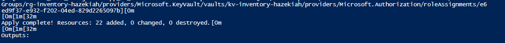
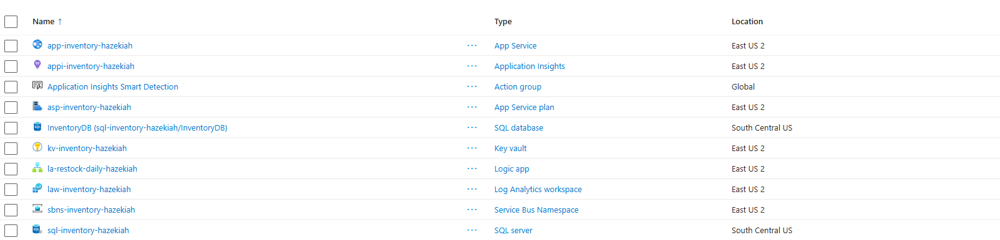
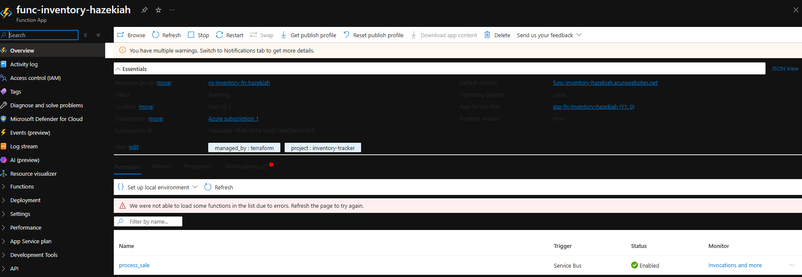
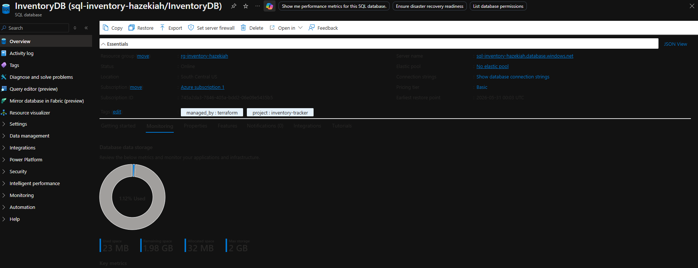
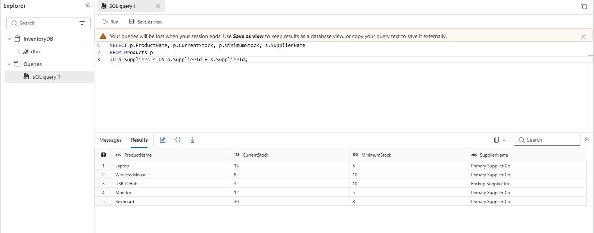
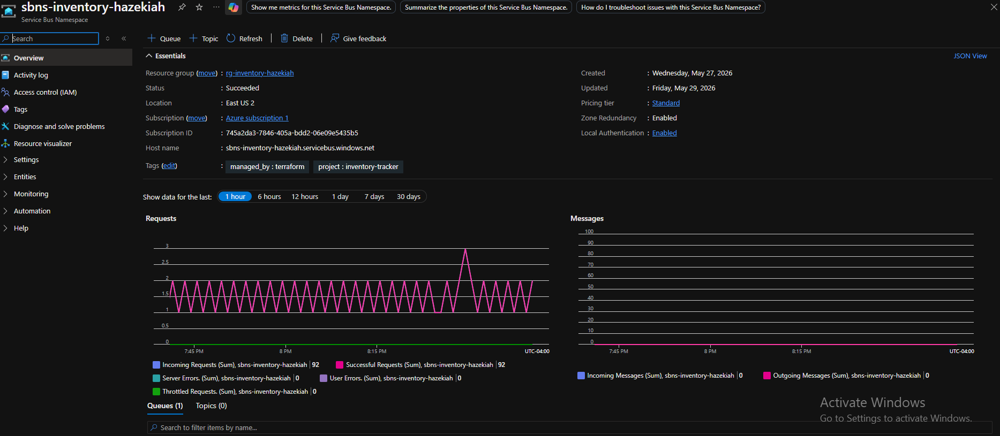
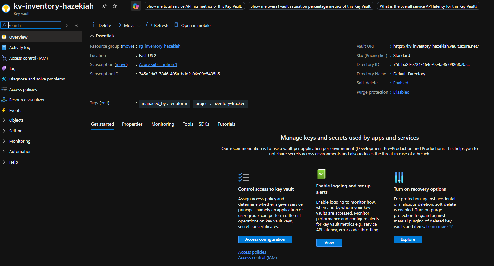
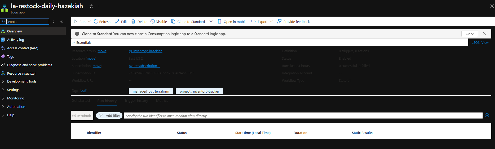
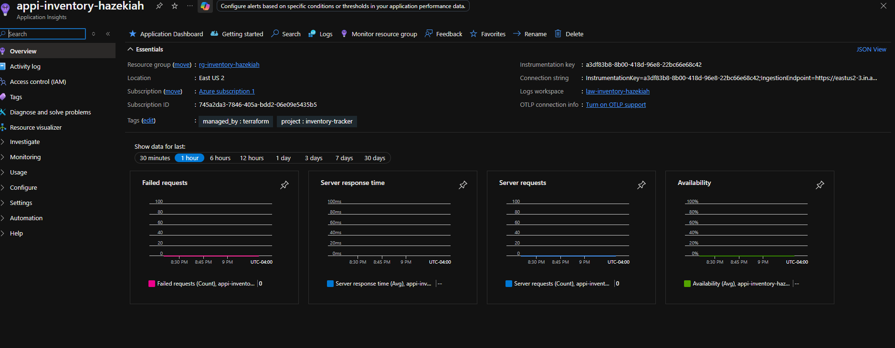

# Azure AI Inventory Tracker

**Platform:** Microsoft Azure  
**Author:** Hazekiah Kennedy  
**Tools:** Azure Functions · Azure SQL · Service Bus · Key Vault · App Service · Logic Apps · Application Insights · Terraform · Python

---

## What This Does

A real-time inventory management system that updates stock counts the moment a sale happens. When a sale event is dropped into the Service Bus queue, an Azure Function picks it up instantly, decrements the stock count in SQL, and logs the movement for audit and analysis. A Logic App runs daily AI-driven restock recommendations via email every morning.

---

## Architecture

```
Sale Event (POS / Web App)
    └── Service Bus Queue (sale-events)
            └── Azure Function (Python 3.10)
                    ├── Decrement stock count → Azure SQL (InventoryDB)
                    ├── Write audit row → StockMovements table
                    └── Log → Application Insights
                                └── Logic App (daily)
                                        ├── Query SQL → 30-day sales patterns
                                        └── Send email → Restock recommendations
```

---

## Resources Deployed

| Resource | Name |
|---|---|
| Resource Group (main) | rg-inventory-hazekiah |
| Resource Group (functions) | rg-inventory-fn-hazekiah |
| SQL Server | sql-inventory-hazekiah |
| SQL Database | InventoryDB |
| Service Bus Namespace | sbns-inventory-hazekiah |
| Service Bus Queue | sale-events |
| Function App | func-inventory-hazekiah |
| App Service Plan (B1) | asp-inventory-hazekiah |
| Web App | app-inventory-hazekiah |
| Key Vault | kv-inventory-hazekiah |
| Logic App | la-restock-daily-hazekiah |
| Application Insights | appi-inventory-hazekiah |
| Log Analytics Workspace | law-inventory-hazekiah |
| Storage Account | stfninventoryhazekiah |

---

## Screenshot Walkthrough

### 01 — Terraform Apply


### 02 — Resource Group


### 03 — Function App + Function Registered


### 04 — SQL Database


### 05 — Table Data + Stock Updated


### 06 — Service Bus Queue


### 07 — Key Vault Secrets


### 08 — Logic App


### 09 — Application Insights


---

## Deploy

```bash
# 1. Fill in terraform.tfvars
cp terraform.tfvars.example terraform.tfvars

# 2. Deploy infrastructure
terraform init
terraform apply -auto-approve

# 3. Deploy function
cd function_app
func azure functionapp publish func-inventory-hazekiah --python --resource-group rg-inventory-fn-hazekiah

# 4. Restore app settings via REST API (see deploy notes)
```

---

## Database Schema

Run `schema.sql` in the Azure SQL Query Editor after deployment.

Tables: `Products` · `Suppliers` · `StockMovements`

---

## Test the Sale Event Flow

```python
from azure.servicebus import ServiceBusClient, ServiceBusMessage
import json

conn_str = "<ServiceBusConnectionString>"
client = ServiceBusClient.from_connection_string(conn_str)
sender = client.get_queue_sender("sale-events")
sender.send_messages(ServiceBusMessage(json.dumps({
    "sale_id": "TEST-001",
    "product_id": 1,
    "quantity": 2
})))
```

Expected result: Laptop `CurrentStock` drops from 15 → 13.

---

## Destroy

```bash
terraform destroy -auto-approve
```
